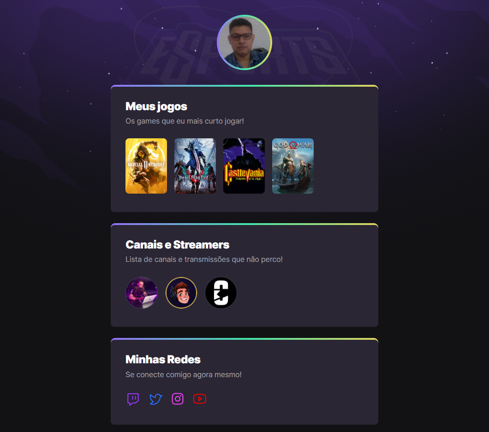

# Fundamentos em Programação
Repositório de treinamento em diversas linguagens de programação
- Javascript
- Python
- HTML

## NLW eSports

> Trilha Explorer

Projeto construído do evento Next Level Week da Rocketseat 

[📎 Clique aqui para acessar](https://andrerondi.github.io/fundamentos/nlw-esports-explorer/)

### 💻 Tecnologias
- HTML
- CSS
- GIT e GitHub

## 😎 Contato

slippandre@gmail.com
andre_castro_rondi@hotmail.com
